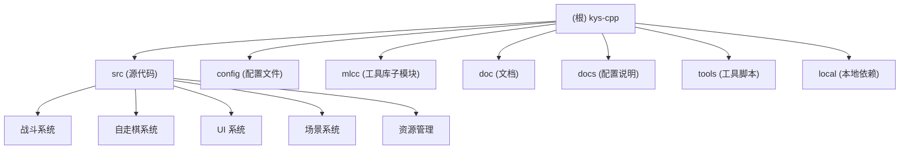

# kys-cpp 项目文档

> 最后更新：2026-02-28 20:20:55

## 变更记录 (Changelog)

### 2026-02-28 20:20:55
- 初始化项目文档
- 完成项目结构扫描与模块识别
- 生成战斗系统、自走棋系统、UI 系统等模块文档

---

## 项目愿景

金庸群侠传复刻版（C++ 实现），基于 SDL3 的 2D 游戏引擎。除了经典的回合制战斗外，还包含半即时战斗（含进度条），以及两种完全即时战斗模式（模仿黑帝斯和只狼的战斗系统）。

**核心特性**：
- 多种战斗模式：回合制、半即时、完全即时（Hades 风格、Sekiro 风格）
- **战斗系统以 BattleSceneHades（自动战棋模式）为主要参考**
- 自走棋玩法（棋池、羁绊、内功、远征挑战）
- 配置驱动的平衡性调整（YAML 配置文件）
- 跨平台支持（Windows、Linux、macOS）

---

## 架构总览

### 技术栈
- **语言**：C++23（使用 `stdcpplatest`）
- **图形库**：SDL3、SDL3_image、SDL3_ttf
- **音频库**：BASS、BASSMIDI
- **数据库**：SQLite3
- **配置**：YAML-CPP
- **脚本**：Lua 5.4
- **构建系统**：Visual Studio 2022 (Windows)、CMake (Linux/macOS)
- **包管理**：vcpkg

### 核心架构
```
Application (应用入口)
    └── Engine (引擎核心)
        ├── Scene (场景基类)
        │   ├── TitleScene (标题场景)
        │   ├── MainScene (主地图场景)
        │   ├── SubScene (子场景)
        │   └── BattleScene (战斗场景基类)
        │       ├── BattleSceneAct (即时战斗基类)
        │       │   ├── BattleSceneHades (自动战棋，主要参考)
        │       │   └── BattleSceneSekiro (只狼风格)
        │       └── BattleScenePaper (纸片战斗)
        ├── RunNode (节点系统)
        ├── TextureManager (纹理管理)
        ├── Audio (音频管理)
        └── Save (存档系统)
```

---

## 模块结构图



---

## 模块索引

| 模块路径 | 职责 | 关键文件 |
|---------|------|---------|
| [src/](./src/CLAUDE.md) | 游戏源代码 | kys.cpp, Application.cpp, BattleSceneHades.cpp |
| [config/](./config/CLAUDE.md) | 游戏配置文件 | chess_pool.yaml, chess_balance_*.yaml, kysmod.ini |
| [mlcc/](./mlcc/CLAUDE.md) | 通用工具库（子模块） | strfunc.cpp, filefunc.cpp, SQLite3Wrapper.cpp |
| [doc/](./doc/CLAUDE.md) | 技术文档 | 架构简介.md, 即时战斗模式Hades.md |
| [docs/](./docs/CLAUDE.md) | 配置说明文档 | 战斗系统说明.md, 平衡配置说明.md |

---

## 运行与开发

### 编译（Windows）
```bash
# 1. 安装 vcpkg 并集成
vcpkg install sdl3 sdl3-image[png] sdl3-ttf lua sqlite3 libiconv asio picosha2 yaml-cpp opencv libzip
vcpkg integrate install

# 2. 获取子模块
git submodule init
git submodule update

# 3. 使用 Visual Studio 2022 打开 kys.sln 并编译
```

### 编译（Linux/macOS）
```bash
# 1. 安装依赖
# Ubuntu/Debian:
sudo apt install libsdl3-dev libsdl3-image-dev libsdl3-ttf-dev liblua5.4-dev libsqlite3-dev libyaml-cpp-dev

# 2. 获取子模块
git submodule init
git submodule update

# 3. 编译
cd src
cmake .
make
```

### 运行
```bash
# Windows
x64\Release\kys.exe

# Linux/macOS
./kys
```

### 配置文件
- `config/kysmod.ini`：主配置文件（分辨率、战斗模式、音量等）
- `config/chess_balance_*.yaml`：平衡配置（经济、星级加成、敌人表）
- `config/chess_pool.yaml`：棋池配置（角色 ID 与费用等级）
- `config/chess_combos.yaml`：羁绊配置
- `config/chess_neigong.yaml`：内功配置
- `config/chess_challenge.yaml`：远征挑战配置

---

## 测试策略

### 当前测试覆盖
- **单元测试**：mlcc 子模块包含 cifa 单元测试（`mlcc/unit_test/cifa/`）
- **手动测试**：主要通过游戏运行验证功能

### 测试建议
- 战斗系统：修改 `config/kysmod.ini` 中的 `battle_mode` 切换不同战斗模式
- 平衡性测试：修改 `config/chess_balance_*.yaml` 调整数值
- 棋池测试：修改 `config/chess_pool.yaml` 调整角色出现

---

## 编码规范

### C++ 风格
- **标准**：C++23（使用最新特性）
- **命名**：
  - 类名：PascalCase（如 `BattleSceneHades`）
  - 成员变量：snake_case + 下划线后缀（如 `battle_roles_`）
  - 函数：camelCase（如 `dealEvent`）
  - 常量：UPPER_CASE（如 `COORD_COUNT`）
- **头文件保护**：使用 `#pragma once`
- **内存管理**：优先使用智能指针（`std::shared_ptr`、`std::unique_ptr`）

### 项目约定
- 所有战斗逻辑以 **BattleSceneHades** 为准
- 配置文件使用 YAML 格式，支持热重载
- 资源文件路径通过 `GameUtil::PATH()` 获取
- 日志使用 `LOG()` 宏（定义在 `Head.h`）

---

## AI 使用指引

### 战斗系统开发
**重要**：所有战斗相关的修改和参考，都应以 `BattleSceneHades` 为准。这是当前主要的战斗模式（自动战棋）。

- **核心文件**：
  - `src/BattleSceneHades.h` / `.cpp`：主战斗逻辑
  - `src/BattleSceneAct.h` / `.cpp`：即时战斗基类
  - `src/BattleScene.h` / `.cpp`：战斗场景基类
- **配置文件**：
  - `docs/战斗系统说明.md`：战斗系统详细说明
  - `config/chess_balance_*.yaml`：平衡配置

### 自走棋系统开发
- **核心文件**：
  - `src/Chess*.h` / `.cpp`：自走棋相关逻辑
  - `src/ChessBalance.h` / `.cpp`：平衡系统
  - `src/ChessCombo.h` / `.cpp`：羁绊系统
  - `src/ChessPool.h` / `.cpp`：棋池系统
- **配置文件**：
  - `docs/棋池配置说明.md`
  - `docs/平衡配置说明.md`
  - `docs/羁绊配置说明.md`

### 常见任务
1. **添加新角色**：修改 `config/chess_pool.yaml` 和 `game/save/0.db`
2. **调整平衡**：修改 `config/chess_balance_*.yaml`
3. **添加羁绊**：修改 `config/chess_combos.yaml`
4. **切换战斗模式**：修改 `config/kysmod.ini` 中的 `battle_mode`（0=回合制，1=半即时，2=Hades，3=Sekiro）

### 代码导航提示
- 入口点：`src/kys.cpp` → `Application::run()`
- 场景切换：`Engine::getInstance()->switchScene()`
- 存档系统：`Save::getInstance()`
- 配置读取：`ChessBalance::loadConfig()`

---

## 相关资源

- **GitHub**：https://github.com/scarsty/kys-cpp
- **资源文件**：http://pan.baidu.com/s/1sl2X9wD
- **授权**：BSD 3-Clause License（金庸武侠题材禁止商用）

---

## 依赖库

详见 `doc/依赖库.md`。

主要依赖：
- SDL3（图形、输入、窗口）
- BASS/BASSMIDI（音频）
- SQLite3（数据存储）
- YAML-CPP（配置解析）
- Lua 5.4（脚本）
- OpenCC（简繁转换，使用自制 SimpleCC 替代）
