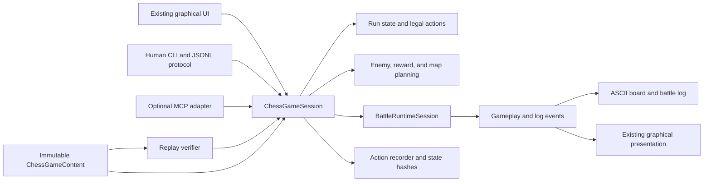

# Headless Auto-Chess and Verifiable Replay Design

## Status

This design has completed architectural review. The contract corrections identified during review have been incorporated, and this document is the stable source of truth for feature behavior, ownership boundaries, deterministic execution, replay verification, and save/timeline semantics.

Implementation sequencing, concrete file migrations, checklists, and build/test checkpoints live in the separate [implementation plan](../plans/2026-07-11-headless-auto-chess-replay.md). Architectural changes must update this specification first; sequencing or file-level discoveries update the execution plan only.

## Goals

The auto-chess game must be playable without rendering, audio, or graphical input. A human or agent must be able to inspect game state, enumerate legal decisions, take actions, resolve battles, and understand results through text or structured data.

The same game must also support deterministic replay verification. Given a declared ruleset and root random seed, a verifier must be able to replay every recorded player decision, reject illegal or altered actions, reproduce automatic outcomes, and confirm the final pieces, equipment, progress, and result.

The design has the following concrete goals:

- provide an interactive CLI suitable for both humans and terminal-driving agents;
- provide a stable machine protocol that can later be exposed through MCP without duplicating game logic;
- describe management state and decision options in text and structured data;
- describe battles with an initial ASCII board, meaningful battle events, and a final summary;
- record every gameplay decision using stable semantic identifiers;
- reproduce all automatic events from a versioned deterministic random seed;
- verify action legality and state evolution at every decision boundary;
- keep the existing graphical game on the same rule implementation as headless play;
- avoid a second implementation of shop, reward, battle, or progression rules.

## Non-Goals

The first implementation does not need to:

- stream every movement frame in the normal text format;
- reproduce camera, animation, sound, particle, rumble, or other visual state;
- provide backward compatibility for obsolete replay versions or rulesets;
- provide runtime backward compatibility for old auto-chess save/checkpoint schemas;
- prove that a player did not search many seeds before choosing one;
- support multiple concurrently simulated sessions inside one process initially;
- ship MCP before the core session and CLI protocol are stable.

## Existing Architecture

The repository already contains a largely headless battle runtime. `BattleRuntimeSession::runFrame()` is the sole post-initialization gameplay advance path and returns `BattlePresentationFrame` values containing gameplay, log, and visual events.

The missing boundary is above and around that runtime:

- `ChessSelector` and the individual flow classes combine UI selection with mutations;
- `ChessBattleFlow::enterBattle()` generates enemies, equipment, battle seeds, rewards, progression, and failure rollback while also displaying UI;
- `ChessBattleFlow::runBattle()` opens pre- and post-battle views and creates a graphical `BattleSceneHades`;
- `BattleSceneHades::onEntrance()` constructs battle units, terrain, rules, runtime input, and optional position-swap UI alongside renderer initialization;
- `BattleSceneFrameApplier` combines report collection with graphical presentation effects;
- `GameState` is a singleton and some flows retrieve it globally instead of operating only on passed state;
- gameplay definitions are also exposed through mutable static/lazy state such as `ChessBalance`, `ChessCombo`, `ChessEquipment`, and `ChessNeigong`;
- content and map loading depend on global `Save`, `BattleMap`, `Font`, and `GameUtil::PATH()` access;
- `ChessRandom` persists two seeds and call counts, but enemy seed rerolls use `std::random_device` and its integer generation depends on `std::uniform_real_distribution` behavior.

These are extraction and ownership problems. The battle rules themselves must not be reimplemented for headless play.

## Target Architecture

Create one deterministic, UI-independent `ChessGameSession` as the sole owner of run-level gameplay state, rules, decisions, pending automatic work, and the active replay journal. Inject one immutable `ChessGameContent` snapshot containing all gameplay definitions and the ruleset identity.



The graphical UI, CLI, replay verifier, and eventual MCP adapter must all call this session API. They may present information differently, but they may not apply game rules independently. The GUI may use one application-owned session host; session/domain code may not retrieve gameplay state or content through globals.

## Session State Machine

The session exposes explicit gameplay phases:

1. `Management`
   - shop purchases and refreshes;
   - selling pieces;
   - buying experience;
   - choosing deployment;
   - managing bans;
   - buying and equipping equipment;
   - starting a normal battle or expedition challenge.
   - after the normal campaign is cleared, this phase remains available with `campaignComplete=true`; normal battle preparation is no longer legal, but management and expedition challenges remain available.
2. `BattlePreparation`
   - generated enemy lineup and equipment are fixed;
   - map choice is offered when a synergy permits it;
   - the initial board is available;
   - optional position swaps are accepted;
   - the player explicitly starts battle resolution.
3. `BattleResolution`
   - no player decisions occur;
   - the battle runtime advances until a terminal result;
   - gameplay and log events are collected.
4. `RewardChoice`
   - equipment, internal skill, challenge reward, or forced ban decisions are resolved;
   - multiple pending choices are represented as successive decision points.
5. `Complete`
   - the player has explicitly accepted `finish_run` after clearing the normal campaign;
   - observation, save-slot operations, replay export, and replay verification remain available;
   - loading an earlier compatible checkpoint may replace the completed timeline and restore its earlier phase;
   - no further gameplay action is legal.

Defeat or timeout returns to `Management` after deterministic rollback of the battle-preparation stream checkpoint. A completed expedition challenge returns to the appropriate reward or management phase.

`finish_run` is legal only at a stable management boundary when `campaignComplete=true` and no battle or reward is pending. A replay can be exported earlier with an `in_progress` footer, but only `finish_run` produces a completed terminal playthrough.

## Core Session Interface

The conceptual session interface is:

- `observe()` returns the deterministic gameplay observation for the current decision point;
- `legalActions()` returns typed parameterized action descriptors with stable identifiers, candidates, and constraints;
- `beginAction(action)` validates and applies exactly one player decision, captures the pre-state/hash, and opens one pending transition;
- `advanceAutomatic(frameBudget)` advances automatic work by a bounded amount;
- `submitAndDrain(action)` is the CLI/verifier convenience path that begins an action and drains automatic work to the next decision boundary;
- `exportReplay()` exports the active journal with an `in_progress` or `complete` footer;
- `ChessReplayVerifier` creates a fresh session and validates a replay from the beginning.

One accepted player action corresponds to one journal transition:

```text
pre-decision boundary
  -> beginAction(action)
  -> zero or more advanceAutomatic() calls
  -> next decision boundary or Complete
  -> append exactly one decision record
```

The GUI may call `advanceAutomatic(1)` per simulation step so battle presentation remains incremental. While a transition is pending, no second player action is legal. A rejected action changes no gameplay state, pending state, random state, save catalog, or journal data.

The finalized action result contains:

- acceptance or a stable rule error code and human description;
- semantic events derived from the action and all automatic work through the next boundary;
- the next observation or terminal result;
- replay sequence, state hashes, RNG digest, and chain hash.

## Typed Player Actions

Actions use semantic identifiers rather than the current position of an item in a menu. The initial action vocabulary is:

- `buy_shop_slot(slot)`;
- `refresh_shop`;
- `set_shop_locked(locked)`;
- `sell_chess(chessInstanceId)`;
- `set_deployment(chessInstanceIds)`;
- `buy_exp`;
- `add_ban(roleId)`;
- `skip_forced_bans`;
- `equip(equipmentInstanceId, chessInstanceId)`;
- `buy_legendary_equipment(itemId)`;
- `set_position_swap_enabled(enabled)`;
- `reroll_enemy_seed`;
- `prepare_battle`;
- `choose_map(mapId)`;
- `swap_positions(firstUnitId, secondUnitId)`;
- `start_battle`;
- `reroll_reward`;
- `choose_reward(rewardId)`;
- `start_challenge(challengeId)`;
- `finish_run`.

`legalActions()` does not enumerate every possible deployment subset. It returns parameterized descriptors such as candidate chess instance IDs and minimum/maximum selection counts. Bans remain monotonic, matching current gameplay; there is no unban action.

Config-defined entities that are currently addressed only by vector index, especially challenges and configured challenge rewards, must receive explicit string IDs. Generated reward IDs use their stable semantic target: equipment item ID, internal-skill magic ID, piece role ID, or chess instance ID. A shop slot remains usable as an action argument because its containing pre-state hash proves which piece occupied the slot.

`mapId` is the stable dynamic battle-map ID currently represented by the selected battle-map record. Deployment IDs are semantically unordered and canonicalized in ascending chess-instance-ID order; explicit pre-battle swaps, not deployment payload ordering, determine formation.

## Instance-Owned Game State

`GameState` must become instance-owned by `ChessGameSession`. The graphical application may retain one application-owned session host, but session logic may not retrieve a global singleton.

Fields currently accessed through `GameState::get()`, including seen roles, bans, and strategist refresh state, must be passed through session state explicitly.

Gameplay-affecting options must be included in session state/rules and the replay header. Pre-battle position swapping must not depend on global `SystemSettings` during verification.

All role, magic, item, equipment, combo, internal-skill, challenge, map, terrain, and battle-effect definitions are loaded into one immutable `ChessGameContent` snapshot from an explicit data root. Sessions of different difficulties may coexist in one process without mutating shared static configuration.

Battle setup must copy all gameplay facts it needs into runtime input so battle results do not depend on mutable `Role` HP or MP left behind by another presentation path. Headless gameplay code may not load content through `Font`, `Save::getInstance()`, `BattleMap::getInstance()`, or mutable `GameUtil::PATH()`.

`GameDataStore` remains the internal persistent run-state structure after it is migrated to the new versioned fields, stream state, stable challenge IDs, and session options. Old serialized shapes are rejected. Replay verification still starts from a new run and recorded actions rather than trusting a supplied final save.

## Run-Level Rule Extraction

Mutations currently embedded in UI flows must move into reusable domain operations. This includes:

- shop refresh, purchase, lock, rejection, and free-refresh behavior;
- selling, merging, roster capacity, and deployment;
- experience purchases and level changes;
- bans and forced ban unlocks;
- equipment purchases, inventory instances, assignment, and replacement;
- enemy lineup and equipment generation;
- map selection and battle seed generation;
- victory economy, interest, experience, free refresh, and fight progression;
- normal, boss, equipment, internal-skill, and challenge rewards;
- challenge completion and repeat-challenge behavior;
- defeat retry RNG restoration.

Existing flow classes become UI adapters that build menus from observations and submit typed actions. No copied headless versions of these rules are permitted.

## Battle Planning and Construction

Extract battle work into three shared components.

### ChessBattlePlanner

The planner:

- generates normal enemy lineups;
- assigns enemy equipment;
- calculates available maps;
- generates the battle random seed;
- produces an immutable prepared-battle description;
- identifies any required map-choice decision;
- captures the complete pre-preparation RNG checkpoint for lineup, equipment, map, and battle-seed streams.

Preparing a battle consumes its random values once. Inspecting the prepared battle does not consume more randomness.

The prepared battle is part of canonical session state. It includes battle kind and ID, enemy lineup and equipment, ally instance IDs, map candidates and chosen map, battle seed, deterministic unit IDs, base formation, applied swaps, and the preparation RNG checkpoint.

Every gameplay ordering uses a total comparator. In particular, equal-strength enemies and equal-star equipment assignments must use stable role, source-order, instance, or item-ID tie-breakers rather than relying on unspecified equivalent-element order.

### BattleSetupFactory

The setup factory:

- loads pure battlefield terrain data;
- resolves ally and enemy positions;
- copies role, equipment, skill, synergy, and internal-skill facts;
- assigns deterministic battle unit IDs;
- builds `BattleRuntimeSessionCreationInput`;
- produces a board description using the same grid positions.

`BattleSceneMapState` currently combines pure terrain and coordinate operations with texture construction. Split its pure portion into a reusable battlefield data or geometry class. Texture creation remains in the graphical scene layer.

Position swaps modify the prepared formation before `BattleRuntimeSession::createInitialized()`. Runtime initialization, including clone creation and other initialization effects, must observe the final formation rather than creating the runtime first and moving only base units afterward.

### HeadlessBattleRunner

The headless runner:

- applies the recorded prepared formation and position swaps;
- creates the same `BattleRuntimeSession` as the graphical scene from that final setup;
- calls `runFrame()` until the runtime reports a terminal result;
- collects gameplay and log events;
- produces the standard post-battle summary and report;
- returns a semantic battle digest for replay verification.

The headless runner does not own termination rules. GUI and headless callers use the same runtime/session termination policy:

- frames 0 through 35,999 may execute;
- if no terminal outcome exists after frame 35,999, one `BattleEnded{Timeout}` semantic event is emitted at frame 36,000;
- a simultaneous wipe is a player defeat at the frame where it occurs;
- timeout is reported distinctly but has defeat progression semantics: no rewards, no fight advance, no fights-won increment, and preparation RNG rollback.

The maximum frame count and outcome semantics are part of the ruleset identity.

## Shared Battle Reporting

Report collection must not depend on graphical frame application.

Extract a pure report collector that consumes initialization events and each `BattlePresentationFrame`. It should build the existing `BattleReport` and post-battle summary without using renderer, camera, audio, or scene state.

The graphical `BattleSceneFrameApplier` then performs only presentation work and uses the same report collector. This provides a direct parity test between rendered and headless execution.

Visual events are not part of replay correctness. Replay hashing uses a structured integer/stable-ID-only `BattleDigestEvent` projection. Skill statistics use skill IDs, status/resource changes use explicit enum IDs, and localized text/log segments are presentation-only. `ProjectileMoved` trace events and raw floating-point positions are excluded from the normal battle digest.

## Text Observation Format

At management decisions, deterministic `GameplayObservation` should include:

- difficulty and current fight;
- level, experience, deploy limit, and gold;
- shop slots with role ID, name, tier, and price;
- roster entries with stable instance ID, star, deployment status, equipment, and fights won;
- active synergies;
- equipment inventory with stable instance IDs and assignments;
- obtained internal skills;
- bans, available ban capacity, and seen roles where useful;
- challenge completion;
- pending reward choices;
- legal commands.

Structured observations contain IDs and rule data rather than formatted menu strings. Presentation-only descriptions may be included as convenience fields but are not authoritative.

`SessionObservation` wraps `GameplayObservation` together with save-slot summaries and session operations. External slot timestamps, labels, and host metadata are not seed-deterministic and never participate in gameplay state hashes.

## Battle Text Format

Normal battle output consists of:

1. battle number, map, and declared battle seed;
2. one initial ASCII board showing actual unit positions;
3. a token legend describing units, stars, HP, equipment, and relevant skills;
4. meaningful battle logs;
5. a final survivor and statistics summary.

Example:

```text
第 7 戰：庭院圍戰  map=21  battle_seed=39182044

     23 24 25 26 27 28 29 30
 23  #  #  E1  .  E2  .  #  #
 24  #  .   .  .   . A2  .  #
 25  #  E3  .  .  A1  .  .  #
 26  #  .   .  .   .  .  .  #

A1 張無忌 ★2  HP 840  倚天劍
A2 黃蓉   ★1  HP 510
E1 ...
```

The board renderer should crop to the relevant battlefield region while preserving grid coordinates. Unit tokens must be stable for the duration of the battle.

Compact logs reuse the existing battle event infrastructure:

```text
[  42F] A1 施放 九陽神功，命中 E2，造成 186 點傷害
[  57F] E3 對 A2：中毒 90F
[ 103F] A2 擊殺了 E1
[ 248F] 戰鬥勝利
```

Normal output does not include every movement or projectile position. A `--trace` mode may include frame-level gameplay events for diagnosis. A structured mode returns event fields rather than parsing human text.

## CLI

Add a separate `kys_chess_cli` executable. It must not initialize an SDL renderer, audio device, window, or graphical scene.

It supports:

- an interactive human REPL;
- newline-delimited JSON requests and responses;
- replay export;
- replay verification;
- explicit root seeds;
- an explicit `--data-root` with an executable-relative default;
- human, compact, JSON, and trace output modes.

Suggested entry points:

```text
kys_chess_cli new --difficulty normal --seed 12345
kys_chess_cli play --seed 12345
kys_chess_cli verify run.kysreplay
```

In JSONL mode, stdout is reserved for protocol messages and diagnostics go to stderr. The protocol methods are:

- `new`;
- `observe`;
- `legal_actions`;
- `act`;
- `list_saves`;
- `inspect_save`;
- `save_game`;
- `load_game`;
- `export_save`;
- `import_save`;
- `export_replay`;
- `verify_replay`.

Each request has a caller-provided request ID, and each response echoes it. `act` uses `submitAndDrain()`; an accepted response is emitted only at the next stable boundary and includes derived events, the next phase, and replay hashes. A `load_game` response includes the restored replay sequence and the number of actions removed from the previously active suffix.

The CLI executable should live outside the current top-level source glob or the source collection must explicitly exclude its `main()` from `kys_game_lib`.

Content loading takes an explicit data root and an injected diagnostics sink. The CLI must not depend on its current working directory or mutate `GameUtil::PATH()`. Its headless core and executable targets must not link renderer, audio, ImGui, or graphical scene dependencies.

The repository build of record is `.github/build-command.ps1`, which builds `kys.sln`. The CLI and shared headless core therefore require Visual Studio solution projects in addition to CMake targets.

## MCP Adapter

MCP is a thin transport adapter over the stable machine protocol. It must not link a second set of gameplay rules.

The initial tool set should be:

- `new_game`;
- `observe_game`;
- `list_legal_actions`;
- `take_action`;
- `list_saves`;
- `inspect_save`;
- `save_game`;
- `load_game`;
- `export_save`;
- `import_save`;
- `export_replay`;
- `verify_replay`.

The first adapter may manage one CLI-backed session. Multiple simultaneous sessions can be added after `GameState` and immutable game content ownership support it cleanly.

CLI and JSONL are implemented before MCP because they provide the simplest direct integration and make the protocol independently testable.

## Deterministic Randomness

Replace the current replay-sensitive use of general-purpose `Random` with `run_rng_xoshiro256ss_v1`.

### Run RNG Algorithm

- The root seed is an unsigned 64-bit value recorded as a fixed-width hexadecimal string in JSON.
- Each stream uses xoshiro256** with four unsigned 64-bit state words.
- One draw is exactly:
  - `result = rotl(s1 * 5, 7) * 9`;
  - `t = s1 << 17`;
  - `s2 ^= s0`, `s3 ^= s1`, `s1 ^= s2`, `s0 ^= s3`, `s2 ^= t`;
  - `s3 = rotl(s3, 45)`;
  - return `result`.
- SplitMix64 version 1 fills the four stream state words:
  - `z = (state += 0x9E3779B97F4A7C15)`;
  - `z = (z ^ (z >> 30)) * 0xBF58476D1CE4E5B9`;
  - `z = (z ^ (z >> 27)) * 0x94D049BB133111EB`;
  - return `z ^ (z >> 31)`.
- If all four generated state words are zero, set `s0 = 0x9E3779B97F4A7C15` so the xoshiro state is valid for every root seed.
- The initial SplitMix64 state uses unsigned wraparound:

```text
rootSeed XOR (0xD2B74407B1CE6E93 * streamTag) XOR enemyPlanKey
```

### Named Streams

Stream tags are protocol constants:

1. shop generation;
2. reward choices;
3. enemy lineup generation;
4. enemy equipment generation;
5. map selection;
6. battle-seed generation;
7. enemy-seed rerolls.

`enemyPlanKey` is always zero for streams 1, 2, and 7, and starts at zero for streams 3 through 6. `reroll_enemy_seed` consumes one raw 64-bit value from stream 7, stores it as the new key, and reinitializes streams 3 through 6. Stream 7 itself is not reset.

Bounded sampling for `upperBound > 0` computes `threshold = (-upperBound) % upperBound` in unsigned 64-bit arithmetic, rejects raw draws below `threshold`, and returns `draw % upperBound`. A stream counter counts raw xoshiro output words, including rejected samples.

The RNG digest canonically encodes `enemyPlanKey`, then every stream tag and raw-draw counter in tag order. Failed actions, observations, legal-action enumeration, save inspection, and rejected loads consume no randomness.

The battle runtime uses its battle-local seed with the separately versioned `battle_rng_mt19937_mod_v1` algorithm. Fixed output vectors are part of the determinism tests. A prepared battle records its battle seed before combat begins.

### Preparation Rollback

The planner captures streams 3 through 6 immediately before battle preparation.

| Outcome | Preparation streams 3-6 | Reroll stream/key | Shop/reward streams |
|---|---|---|---|
| Normal victory | keep | keep | keep |
| Normal defeat or timeout | restore checkpoint | keep | keep |
| First challenge victory | keep | keep | keep |
| Challenge defeat or timeout | restore checkpoint | keep | keep |
| Repeated completed-challenge victory | restore checkpoint | keep | keep |
| Rejected action | unchanged | unchanged | unchanged |

This matrix is applied only by the shared session outcome handler.

### Determinism Profile

The first supported profile is `win-x64-msvc-v143-fp-strict-v1`. Shared battle and chess core targets use strict floating-point semantics, and Debug and Release must accept the same golden replays and produce the same golden battle digests.

Other builds must declare a different profile and are rejected until they have profile-specific golden coverage. Android and WASM are not silently claimed replay-compatible.

## Replay Format

A replay contains a header, decision records, and a footer record.

### Replay Header

The header contains:

- magic identifier;
- replay format version;
- engine replay version;
- run RNG algorithm version;
- battle RNG algorithm version;
- determinism profile;
- ruleset hash;
- difficulty;
- root seed;
- gameplay-affecting options.

### Decision Record

Each accepted player decision records:

- monotonic sequence number;
- phase and decision kind;
- typed action payload;
- pre-state hash;
- post-state hash;
- derived-event hash;
- named RNG counters or RNG digest;
- previous chain hash;
- resulting chain hash.

The record is appended only after the accepted action and all automatic work reach the next stable decision boundary or `Complete`. Its pre-state hash refers to the boundary before `beginAction()`; its post-state/event/RNG hashes refer to the finalized boundary after automatic work.

The minimal replay does not store automatically generated enemy or reward results as trusted input. Those results are reproduced by the verifier. Optional diagnostic records may include them for readability, but verification ignores them as authority.

### Footer Record

Every export ends with a footer containing:

- status: `in_progress` or `complete`;
- terminal chain hash;
- final semantic state hash;
- result: `in_progress` or `campaign_complete`;
- fight reached;
- optional human summary.

`in_progress` exports are legal only at stable decision boundaries and are fully verifiable through their current state. `complete` requires an accepted `finish_run`.

The first JSONL shape is:

```json
{"record":"header","magic":"KYS_CHESS_REPLAY","replay_format_version":1,"engine_replay_version":1,"run_rng":"run_rng_xoshiro256ss_v1","battle_rng":"battle_rng_mt19937_mod_v1","determinism_profile":"win-x64-msvc-v143-fp-strict-v1","ruleset_hash":"<64 hex>","difficulty":"normal","root_seed":"0x0000000000003039","options":{"position_swap_enabled":true,"battle_frame_limit":36000}}
{"record":"decision","sequence":1,"phase":"Management","decision_kind":"refresh_shop","action":{"type":"refresh_shop"},"pre_state_hash":"<64 hex>","post_state_hash":"<64 hex>","event_hash":"<64 hex>","rng_digest":"<64 hex>","previous_chain_hash":"<64 hex>","chain_hash":"<64 hex>"}
{"record":"footer","status":"in_progress","terminal_chain_hash":"<64 hex>","final_state_hash":"<64 hex>","result":"in_progress","fight_reached":0}
```

After `finish_run`, the alternative footer uses `"status":"complete"` and `"result":"campaign_complete"`.

## Canonical State and Event Hashing

Hashing uses an explicit canonical byte encoding rather than relying on JSON object ordering or native struct layout.

Canonical encoding version 1 uses:

- little-endian byte order;
- booleans as one byte, exactly 0 or 1;
- enums and variant tags as unsigned 16-bit values;
- numeric gameplay IDs and values as declared fixed-width 32-bit integers;
- signed integers encoded as their fixed-width two's-complement bit pattern;
- seeds, replay sequences, RNG counters, and save revisions as unsigned 64-bit values;
- strings as validated UTF-8 with no normalization, encoded as an unsigned 32-bit byte length followed by bytes;
- optional values as a one-byte presence flag followed by the value when present;
- collections as an unsigned 32-bit count followed by canonical elements;
- raw 32-byte SHA-256 values inside canonical input and lowercase hexadecimal only at JSON boundaries.

Each top-level projection begins with a four-byte ASCII domain tag and unsigned 16-bit version:

- `HDR1`: replay header fields in the JSON header order defined above;
- `ACT1`: action variant tag followed by payload fields in action-definition order;
- `STA1`: semantic gameplay state;
- `EVT1`: semantic event count followed by events in occurrence order;
- `RNG1`: enemy plan key followed by stream tag/counter pairs in tag order.

Maps and sets are sorted by canonical key bytes. Semantically unordered ID collections are sorted numerically or lexicographically. Semantically ordered collections preserve order. Shop entries preserve slot order; event lists preserve occurrence order. Deployment is a set and is sorted by chess instance ID; prepared ally source order is therefore ascending chess instance ID before explicit position swaps.

Native struct bytes, padding, pointers, addresses, raw floating-point values, localized labels, timestamps, UI state, camera state, visual events, sound, and animation are forbidden.

The normal run-state hash includes:

- difficulty, economy, level/experience, fight progress, and `campaignComplete`;
- roster instances and stars in chess-instance-ID order;
- sorted deployment IDs;
- equipment instances and assignments in equipment-instance-ID order;
- shop contents in slot order, lock state, and sorted rejected-role IDs;
- sorted bans, seen roles, completed challenge IDs, and obtained internal-skill IDs;
- pending reward/map/forced-ban decision and its stable candidate IDs;
- current phase and gameplay-affecting session options;
- the complete prepared battle: kind/ID, enemy lineup/equipment, sorted ally instance IDs, map candidates/chosen map, battle seed, deterministic unit IDs, base formation, applied swaps, and preparation RNG checkpoint;
- the `RNG1` projection.

The preparation checkpoint canonically encodes its captured `enemyPlanKey` followed by stream tags 3 through 6 and their captured raw-draw counters. Save snapshots may cache the four xoshiro state words per stream, but canonical authority remains the root seed, key, and counters reproduced by the journal.

Configured challenge/reward string IDs use canonical string encoding. Generated numeric role, magic, item, chess-instance, equipment-instance, map, skill, status, and resource IDs use fixed-width numeric encoding. Configured reward choices must have unique configured IDs; generated choices with the same semantic payload are deduplicated before legal actions are exposed.

The battle digest includes `BattleDigestEvent` values in occurrence order, battle outcome, end frame, final unit vitals, structured relevant statuses, report statistics keyed by skill ID, and persistent effects such as fights won. The digest event field order is type, frame, source unit ID, target unit ID, amount, effect/skill/status/resource ID, and related attack ID. Fields unused by an event type encode their declared sentinel value. It excludes `ProjectileMoved`, purely visual events, positions, localized text, and human-formatted log strings.

Use SHA-256 through the existing `picosha2` dependency. The chain is conceptually:

```text
chain[0] = SHA256("KYS_CHESS_REPLAY_CHAIN_V1" || canonicalReplayHeader)
chain[i] = SHA256(chain[i-1] || canonicalAction || postStateHash || eventHash || rngDigest)
```

A transition with no semantic events hashes the valid `EVT1` encoding with a zero event count; it never substitutes an all-zero hash.

A chain detects alteration or corruption when the expected terminal hash is trusted separately. It does not by itself prevent an attacker from rewriting a whole replay and recomputing the chain; legality still comes from deterministic replay.

## Ruleset Identity

The verifier only accepts a replay when its replay version and ruleset identity are supported exactly.

The ruleset hash covers:

- replay, run RNG, battle RNG, canonical encoding, and semantic-event protocol versions;
- determinism profile;
- the 36,000-frame timeout and simultaneous-wipe policy;
- relevant top-level `config/chess_*.yaml` content;
- canonical role, magic, item, equipment, and internal-skill gameplay data;
- battle map and terrain gameplay data;
- compiled gameplay rule version.

Raw SQLite file bytes should not be used as the only data identity because physically different database files can contain the same logical records. Hash the canonical gameplay records required by auto-chess.

The hash is computed from the injected immutable `ChessGameContent` snapshot, not mutable static caches or raw file locations. When gameplay code or data intentionally changes, increment the replay/ruleset version or produce a different ruleset hash. Obsolete formats and determinism profiles are rejected instead of maintained through compatibility branches.

## Replay Verification

Verification always begins from a fresh session. It does not trust a serialized final `GameDataStore`.

For each decision record, the verifier:

1. confirms the current phase and pre-state hash;
2. enumerates legal actions;
3. confirms the recorded typed action is legal;
4. calls `beginAction()`;
5. calls `advanceAutomatic()` until the next decision boundary;
6. compares derived-event, RNG, post-state, and chain hashes;
7. stops at the first mismatch with the sequence number and mismatch category.

After the last decision, it verifies the footer state and final chain hash. A `complete` footer must reproduce `Complete` with result `campaign_complete`; an `in_progress` footer must reproduce the declared stable decision boundary and current semantic state.

Verifier failure categories should distinguish:

- malformed replay;
- unsupported replay version;
- unsupported determinism profile;
- ruleset mismatch;
- pre-state mismatch;
- illegal action;
- RNG divergence;
- derived-event divergence;
- post-state mismatch;
- chain mismatch;
- truncated replay;
- unexpected extra decisions.

## Save, Load, Timeline Replacement, and LLM Awareness

Save and load are intentional player capabilities. Loading an earlier compatible checkpoint rolls the game back, removes later actions from the active playthrough, and lets the player choose a different continuation. Headless and MCP play must expose this capability clearly rather than treating rollback as forbidden or as a hidden implementation detail.

Save slots are **session meta-state outside the current gameplay timeline**. Loading a save replaces the active gameplay state and active journal, but it does not erase the external save-slot catalog. This is the same distinction as the graphical game: save files exist outside the in-memory game state that one of those files restores.

Save, load, and replay export are permitted only at stable decision boundaries. They are not permitted while an accepted action still has pending automatic work.

The LLM-facing `SessionObservation` therefore contains two related views:

- `gameState`, which is the current rollbackable game state and current journal head;
- `saveSlots`, which lists external checkpoints that the player may save to or load from.

The observation and tool descriptions must say explicitly that loading a slot:

- replaces current game state with the saved state;
- restores the saved RNG state;
- restores the journal prefix stored in that save;
- discards actions taken after that prefix from the active journal;
- preserves the save-slot catalog;
- can be used strategically to try a different continuation.

This makes save/load discoverable to an LLM in the same way that shop refresh, selling, or deployment are discoverable. It does not rely on the LLM guessing that files or hidden rollback operations exist.

### Save Checkpoint Envelope

A headless/session save should contain:

- save format version;
- engine replay version and ruleset hash;
- root seed and gameplay options;
- replay sequence number;
- terminal chain hash at that sequence;
- canonical state snapshot;
- canonical state hash;
- named RNG state or counters;
- current phase and pending decision;
- the complete active journal header and all decision records through the saved sequence;
- a monotonic save revision;
- presentation-only metadata such as an optional label or wall-clock display time.

The complete active journal is mandatory save-file content, not an optional external reference. A copied save must be self-contained: after loading it, the player can continue making decisions and later export a complete final journal without requiring the original process, another save file, or a separate replay sidecar.

Snapshots exist for fast restoration. They are not accepted as proof merely because their embedded hashes are internally consistent; a player who edits a local file can recompute an ordinary SHA-256 hash. Save revisions participate only in save metadata, not gameplay hashes; wall-clock timestamps never participate in canonical encoding.

When loading a checkpoint, the implementation validates that its embedded journal reproduces the checkpoint chain and state hash. It may use the state snapshot as a fast restoration cache after validation. The final standalone verifier remains able to ignore snapshots and replay the final active action history from the root seed.

### Active Journal Replacement

A save captures both state and the complete active journal prefix that produced it. Consider this history:

```text
A1 A2 A3 A4  save(slot 1)  B1 B2 B3
```

Loading slot 1 restores the state and journal after `A4`. If the player then takes `C1 C2`, the active journal becomes:

```text
A1 A2 A3 A4 C1 C2
```

`B1 B2 B3` are abandoned actions and do not appear in the final gameplay journal. The load operation itself also does not need to appear in that final journal because it did not produce a new gameplay state from `A4`; it selected the already saved `A1...A4` timeline as the new journal head.

This is the required behavior when save/load is part of the game. The final verifier proves that the final active journal is a legal path from the seed to the claimed result. It does not attempt to report discarded experiments that the game intentionally permits the player to erase by loading.

The live CLI or MCP response to a load should still make the replacement obvious to the acting LLM:

```text
timeline_replaced:
  loaded_slot: 1
  previous_sequence: 7
  restored_sequence: 4
  discarded_active_actions: 3
  current_state_hash: ...
```

This response belongs to the interactive session transcript, not the final gameplay journal. An optional diagnostic host audit may retain all save, load, and discarded interactions for debugging, but it is separate from the compact final replay proof.

### Decision-Boundary Saves

The first implementation saves only at stable decision boundaries:

- management;
- pending map choice;
- prepared formation before battle starts;
- pending reward or forced ban;
- completed run.

It does not save an in-progress battle frame. Battles are deterministic and automatic, so loading a pre-battle checkpoint and resolving the battle again produces the same result. This avoids serializing the large internal `BattleRuntimeState`, pending frame queues, projectiles, and presentation state.

A `Complete` session is also a stable boundary. It may be saved, inspected, exported, or replaced by loading an earlier compatible checkpoint. Loading such a checkpoint restores the checkpoint phase and may therefore return the session to `Management`.

### Save-Slot Observation

Every stable decision-boundary `SessionObservation` should include a compact save section even when the LLM did not explicitly ask for it. For example, management output may show:

```text
存檔：
  slot 1  第4戰前  等級4  $18  6枚棋子  journal=31
  slot 2  空
  auto    第5戰勝利後  等級5  $23  7枚棋子  journal=44

可用存檔操作：save 1、save 2、load 1、load auto
載入會回到該狀態，並捨棄目前存檔點之後的行動。
```

Structured observation includes, per slot:

- slot ID;
- occupied state;
- monotonic save revision and optional presentation timestamp;
- fight, level, gold, roster count, and short roster summary;
- replay sequence and state hash when available;
- ruleset compatibility;
- whether loading is currently permitted.

The short summary lets an LLM choose a useful rollback point without first loading every slot. A separate `inspect_save(slot)` operation may return the complete saved observation without changing the active timeline.

### Session Operations Versus Gameplay Actions

Save and load should be represented as session operations, not ordinary deterministic gameplay actions:

- gameplay actions are appended to the active replay journal and affect state hashes;
- `save(slot)` copies the current snapshot and journal prefix into external slot storage but does not change gameplay state or RNG;
- `load(slot)` replaces the active snapshot and journal prefix with the saved versions;
- `inspect_save(slot)` reads external metadata without changing state or RNG;
- `export_save(slot)` returns the portable checkpoint envelope without changing state or RNG;
- `import_save(slot, payload)` validates and stores a compatible checkpoint without making it active.

`observe()` returns deterministic gameplay state and legal gameplay actions. The session controller wraps it as `SessionObservation` with available session operations and save-slot metadata. Human CLI help and MCP tool descriptions must explain the distinction and rollback behavior.

This separation keeps the final journal minimal while still making save/load first-class and obvious during interactive play.

### MCP Save Tools

The MCP adapter should expose the same visible save-slot mechanic as the graphical game:

- `list_saves()` returns slot summaries and explains load consequences;
- `inspect_save(slot)` returns a saved observation without loading it;
- `save_game(slot)` overwrites the slot with the current state and journal prefix;
- `load_game(slot)` replaces the current state and journal head and reports how many current actions were discarded;
- `export_save(slot)` exports a portable save envelope;
- `import_save(slot, payload)` imports a compatible save into a slot without silently making it the active game.

The normal action tool must not accept arbitrary serialized state as an action payload.

### Save Format Compatibility Policy

The new checkpoint schema replaces the old auto-chess slot shape. Runtime loading does not support snapshot-origin journals or synthesize missing action history.

- compatible new-format checkpoints contain the complete journal prefix and can continue producing a fully verifiable replay from the original root seed;
- incompatible or old auto-chess slot versions are rejected with a stable error;
- replay files remain separate authoritative verification inputs;
- ordinary non-auto-chess scene persistence is outside this replay contract.

The existing `SavePersistence::SlotData` representation must be replaced or extended into a public versioned checkpoint envelope owned by the headless save abstraction. Saving captures the current state and journal prefix. Loading restores the journal, `GameDataStore`, RNG state, phase, pending decision, and options. Subsequent accepted actions append to that restored journal, and the next save writes the resulting active journal again.

### Security Limitation

Because the game intentionally allows rollback, the compact final journal cannot and should not prove that no discarded timelines existed. It proves only that the final selected timeline is legal.

If a separate competition later requires proof that no rollback occurred, that would be a different ironman mode with externally enforced save policy or trusted checkpoint logging. It must not redefine ordinary save/load behavior.

## Compression and Storage

Start with compact JSONL for visibility during development. Canonical hashes do not depend on the JSON representation.

Once stable, package a replay as a deflated `.kysreplay` archive using the existing libzip dependency. The archive may contain:

- `replay.jsonl` for the authoritative compact record;
- `summary.txt` for human inspection;
- optional battle logs or diagnostic traces.

Only the authoritative replay record is required for verification. Diagnostic files are not trusted inputs.

## Legitimacy Boundary

Offline verification proves:

> The recorded actions form a legal playthrough for the declared seed, gameplay options, engine replay version, determinism profile, and ruleset, and they deterministically produce the claimed verified state.

It does not prove that the seed was selected fairly or that the player did not explore other seeds first.

If stronger legitimacy is later required, add a challenge mode with:

- a server- or tournament-issued unpredictable seed;
- a signed replay header or seed commitment;
- an authoritative verifier retaining the terminal chain hash;
- optional submission metadata outside the gameplay replay.

This security layer does not change the deterministic session or action format.

## Execution Planning

This specification intentionally does not duplicate task ordering, file lists, or checkbox status. The single mutable execution ledger is the [Headless Auto-Chess and Verifiable Replay Implementation Plan](../plans/2026-07-11-headless-auto-chess-replay.md).

- Changes to behavior, architecture, determinism, replay semantics, or compatibility update this specification first and then any affected execution tasks.
- Discoveries about file ownership, sequencing, tests, or build commands update the execution plan only.
- Additional per-task plans are unnecessary unless a genuinely independent follow-on feature is split from this scope.

## Test Strategy

The implementation requires the following test groups.

### Action and State Tests

- legal-action enumeration for every phase;
- valid action mutation;
- invalid action non-mutation, including RNG counters;
- stable-ID behavior after sorting or presentation changes;
- no second action while a transition is pending;
- post-clear management/challenges and `finish_run` legality;
- shop, roster, merge, ban, equipment, reward, and challenge edge cases.

### Determinism Tests

- two fresh sessions with the same seed and actions produce identical observations, events, battles, and final hashes;
- fixed SplitMix64, xoshiro256**, bounded-sampling, raw-counter, and battle-RNG golden vectors;
- named stream isolation prevents reward calls from changing shop or enemy results;
- every preparation rollback-matrix row restores exactly the intended streams;
- total-order tie cases produce stable gameplay iteration;
- restart-and-resume from a decision record reproduces the same next state where checkpoints are supported;
- Windows x64 MSVC v143 Debug and Release accept the same golden replays and battle digests.

### Battle Parity Tests

- identical prepared battle input yields the same session input for GUI and headless paths;
- GUI and headless frame execution yield the same gameplay events, report, result, end frame, and final semantic digest;
- position swaps affect both paths identically;
- timeout emits exactly one event at frame 36,000 and uses defeat rollback/progression;
- simultaneous wipe is a deterministic player defeat.

### Replay Tests

- serialization round-trip;
- canonical ordering independence;
- modified action rejection at the exact sequence;
- removed, inserted, duplicated, reordered, and truncated record rejection;
- RNG, event, state, chain, and ruleset mismatch detection;
- unsupported determinism-profile rejection;
- stable-boundary `in_progress` footer verification and terminal `campaign_complete` footer verification;
- final roster and equipment verification;
- one committed short golden replay and one complete scripted run.

### Save and Provenance Tests

- save and resume at every supported decision phase;
- save/export rejection while automatic work is pending;
- resumed execution produces the same next observation and final hash as uninterrupted execution;
- observations list compatible save slots and explain that load discards the current suffix;
- inspecting a save does not change state, journal, or RNG;
- loading an earlier compatible checkpoint restores its state, RNG, and journal prefix;
- actions after the loaded checkpoint disappear from the active final journal;
- new actions append to the restored prefix and verify as one linear final timeline;
- save-slot storage remains available after loading an earlier gameplay state;
- save revisions/timestamps do not change gameplay hashes;
- edited snapshots fail replay-prefix validation;
- incompatible old checkpoint schemas are rejected explicitly;
- the full verifier succeeds while ignoring all snapshot caches.

### CLI and MCP Tests

- JSONL stdout contains no diagnostic noise;
- request IDs are preserved;
- observations and legal actions are machine-consumable;
- interactive commands map to the same typed actions;
- explicit and executable-relative data roots behave identically;
- save export/import responses match across JSONL and MCP;
- headless execution opens no window and initializes no audio;
- MCP tools return the same results as direct JSONL requests.

For non-trivial implementation increments, run the repository build through `.github/build-command.ps1` and execute the relevant unit and integration tests. The documented running-game file-lock exception applies only to final linking of `kys.exe`; `kys_tests` and `kys_chess_cli` must link and pass.

## Acceptance Criteria

The feature is complete when:

- a new game can be started with an explicit seed from `kys_chess_cli`;
- every gameplay decision can be made without graphical UI;
- the current state and legal actions can be obtained as structured data;
- battles resolve using `BattleRuntimeSession` without initializing graphical systems;
- GUI and headless execution share the exact 36,000-frame timeout and simultaneous-wipe policy;
- each battle produces an initial ASCII board, meaningful logs, and a final summary;
- the graphical game routes the same decisions through `ChessGameSession`;
- a GUI playthrough and equivalent CLI playthrough produce the same replay hashes;
- every accepted decision is recorded automatically;
- post-clear management and expedition challenges remain playable until `finish_run`;
- stable-boundary replay export verifies with an `in_progress` footer, and `finish_run` produces `campaign_complete`;
- observations and MCP tools make save, inspect, and rollback capabilities obvious to an LLM;
- runs can be saved, closed, and resumed without changing the saved journal prefix;
- compatible saves can be exported/imported without activating them, while old checkpoint schemas are rejected;
- loading an earlier compatible checkpoint restores its journal prefix and removes the abandoned suffix from the active journal;
- the final verifier accepts the selected final timeline without requiring discarded rollback attempts;
- a verifier can reconstruct the run from seed and actions and validate the final pieces and equipment;
- the Windows x64 MSVC v143 Debug and Release builds accept the same committed golden replays;
- altered, illegal, corrupted, truncated, or wrong-ruleset replays are rejected precisely;
- no duplicated gameplay implementation exists between GUI, CLI, verifier, or MCP.

## Implementation Readiness Assessment

This architecture and deterministic contract are approved for implementation.

The authoritative execution breakdown is the separate [implementation plan](../plans/2026-07-11-headless-auto-chess-replay.md). Its first implementation slice is a seeded new game plus shop observation, refresh, purchase, sell, experience purchase, and deployment through both GUI and direct session calls. No old mutation path may be deleted until its focused parity tests pass.
